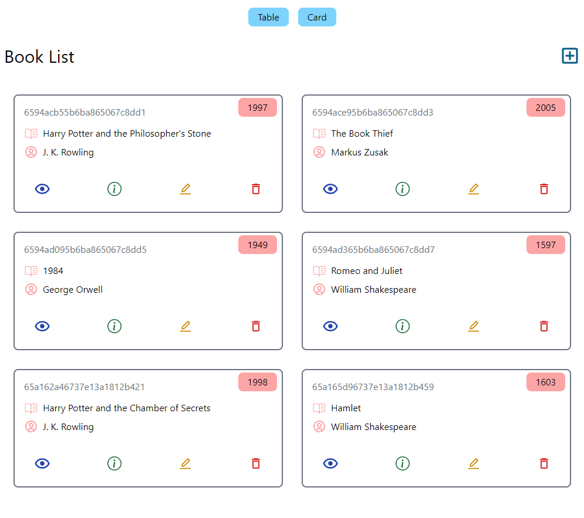
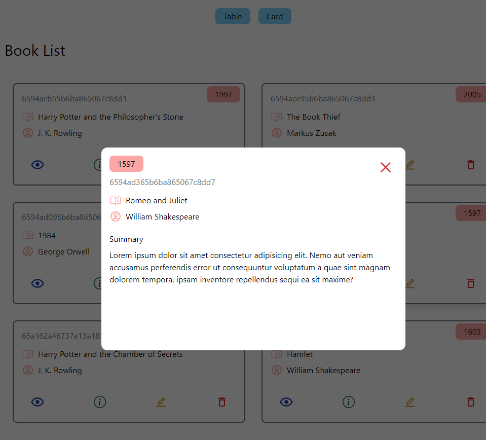

# Bookstore
Book catalogue project created as part of my fullstack development studies using ReactJs, NodeJs, Express and MongoDB. The style was made using Tailwind CSS. It contains the basic CRUD operations and the react router dom was used to pagination.

## 👩🏾‍💻 Technologies

- React JS
- Node JS
- Express JS
- MongoDB
- Tailwind CSS
- Vite
- Figma

## ✉ Contact

contatolucioaraujo@gmail.com

[Linkedin](https://www.linkedin.com/in/lucioaraujo30/)